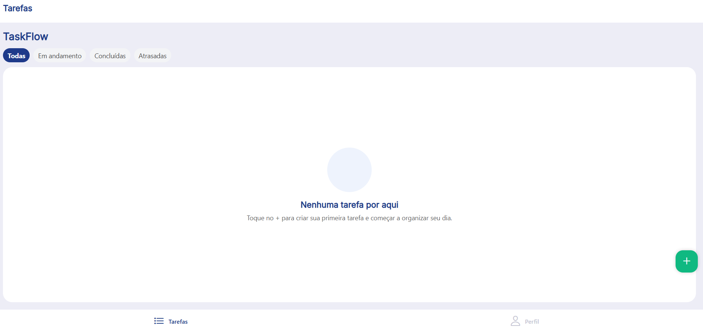
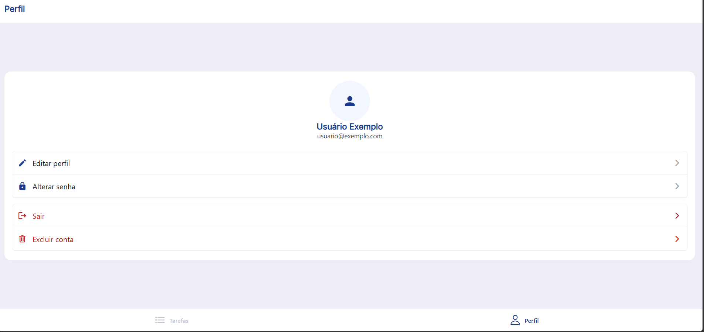

# TaskFlow
Guia Visual

## Cores do sistema
As cores principais do projeto são:  
- azul escuro (#1E3A8A): utilizada em botões principais e títulos  
- azul claro (#1F62EB): utilizada para tarefas em andamento  
- verde (#10B981): utilizada para tarefas concluídas  
- vermelho (#BA1A1A): utilizada para tarefas atrasadas e ações destrutivas  
- preto (#000000): utilizada em textos  
- branco (#FFFFFF): utilizada em cards  
- fundo (#EDEDF6): utilizada como cor de fundo principal  

## Componentes padronizados
- `BotaoAzulEscuro`: utilizado para ações principais da aplicação. Exemplo: Login, Salvar alterações, Criar tarefa
- `BotaoCancelar`: utilizado para interromper uma ação sem salvar alterações. Exemplo: Cancelar edição de perfil e tarefa
- `BotaoVermelho`: utilizado para ações destrutivas. Exemplo: Excluir perfil e tarefa
- `TextInput`: utilizado para entrada de dados do usuário. Exemplo: Nome, e-mail, senha, título, descrição
- `DateTimePicker`: utilizado para seleção de datas e horários. Exemplo: Data de nascimento e prazo da tarefa

## Capturas de tela
### Splash Screen  
Tela inicial da aplicação apresentada durante o carregamento do sistema com gradiente nas cores principais do projeto.  
  
### Login  
Tela de autenticação do usuário com card centralizado, ícone, campos de entrada e botão principal.  
  
### Tarefas  
Tela principal do sistema responsável pelo gerenciamento das tarefas cadastradas.   
  
### Perfil  
Tela de gerenciamento do perfil com ícone de avatar e acesso a outras funcionalidades.  
